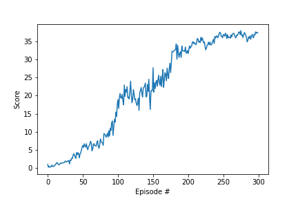

# Report
This is the report of my experiments in training DDPG agents. 

## Learning algorithm
I started from the DDPG agent in the Udacity repository explained introduced in one of the lessons. I extended it to implement 20 agents sharing the same replay buffer.

The model is a set of fully connected layers (1 or 2 in my experiments) that connect the 37 state variables with the 4 possible actions.

The agent makes use of an experience replay buffer from where it randomly samples previous `(state, action, reward, next_state)` tuples to build the batch for training.

### Parameters
The actor and critic network are made of two connected layers of 256 and 128 nodes respectively.

Other parameters for the DDPG agent are:
- Replay buffer size: `100000`
- Minibatch size: `128`
- Discount factor gamma: `0.99`
- Tau for soft update of target parameters: `0.001`
- Learning rate of the actor and the critic: `0.001`
- Weight decay: `0`

After trying some different values, I decided to keep them as set by the DDPG agent explained in the lesson.

I did not introduce a gradient clipping like suggested in the project introduction because it did not yield any improvement during training.

## Results
After few consistent training runs completed in under 200 episodes, I decided to train my DDPG agent for 300 episodes (1000 steps max per episode), storing the fully trained checkpoints and the checkpoints from the earliest successful episode (i.e. the first time that 100 consecutive episodes had an average score greater than 30). After the training I watched the earliest and fully trained models for 3 times and recorded those scores.

The environment was solved in XXX episodes, although I had runs with quicker training. Below is the plot of scores in training episodes.

Scores of 3 runs using the earliest model: `[39.14999912492931, 39.09049912625924, 38.980999128706756]`

Scores of 3 runs using the fully trained model: `[39.17849912429229, 38.85649913148954, 39.13799912519753]`

## Future work
Plans for improving my results include:
- implement suggestions from the project introduction, like being less aggressive in updates per step
- improve the actor and critic networks by adding batch normalisation or changing the architecture
- try out different algorithms like PPO
 
